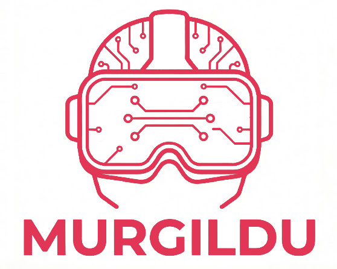

# 🎨 [EHU 3D Graphics Lab](https://github.com/murgildu/murgildu.github.io) (murgildu)

Welcome to the **3D Graphics Laboratory** at the University of the Basque Country (EHU)
A creative playground where students can explore, experiment, and build with **3D technologies**.

[Get Started](https://dif3dgela.github.io/about/)
[Discord](https://discord.gg/wqEvEaegyv)

---

## 🚀 What We Do
- **3D Modeling & Animation** – Blender, open-source tools, and artistic workflows
- **Game Engines and game intelligence** – Unity, Godot, and interactive experiences
- **3D Printing & Fabrication** – from digital models to physical objects
- **Research & Learning** – workshops, tutorials, and collaborative projects

check our [projects](https://github.com/dif3dgela) developed by students

---

## 🌍 Join the Lab
This lab is open to **students of all backgrounds** whether you’re into programming, design, art, or just curious about 3D!

- 📚 Learn by doing
- 🛠️ Share your projects
- 🤝 Collaborate with peers

---

## 📢 Stay Connected
We’re just getting started! This site will grow with resources, guides, and showcases of student work.

👉 Follow updates here and on our GitHub repository.
👉 Contribute ideas, projects, or tutorials to help the lab thrive!
👉 Join our [Discord channel](https://discord.gg/wqEvEaegyv)

---

Made with 💡 by the **EHU 3D Graphics Lab** team.
